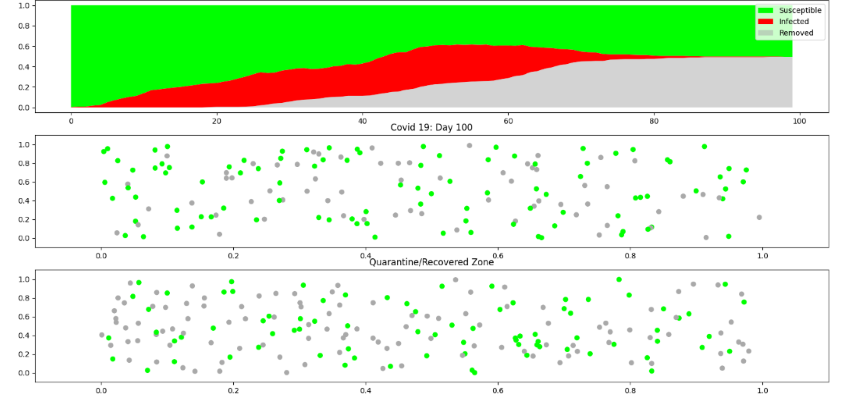
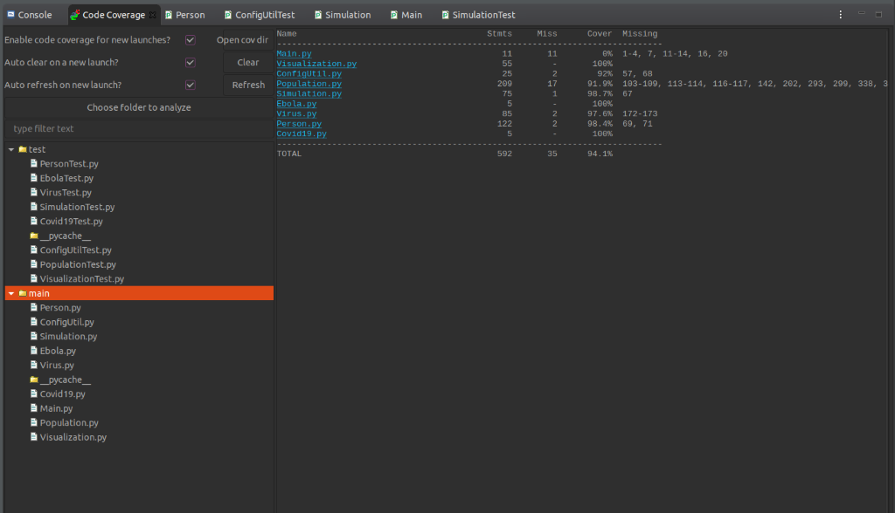
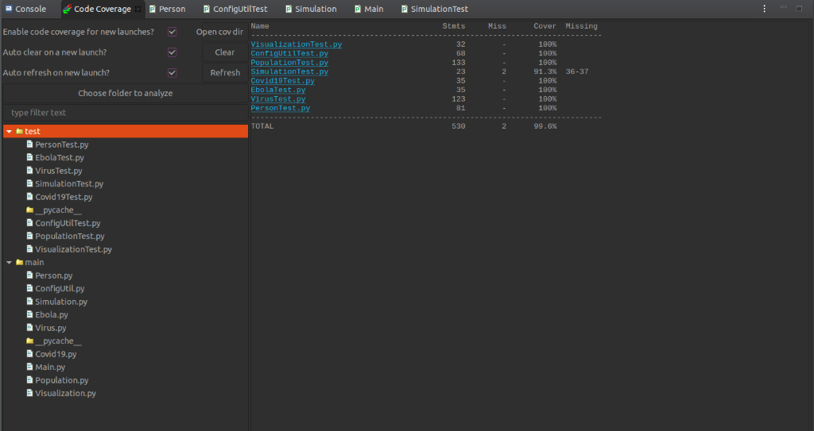

# INFO6205-Project
# Team Number : 9
## Team Members:
Darasy Reth (Section 02)  
Kshitij Verma (Section 06)  
Vedant Jain (Section 06)  

## Project Description: 
Our task is to simulate the spread of a virus such as SARS-CoV-2, the pathogen behind COVID-19, and Ebola.   
The codes are written in Python3 which includes all the backend data analysis as well as function to visualize the simulation.  
Following things that are considered for building this simulator:  
    • The K and R factors of the disease  
    • The social distancing 
    • The population density 
    • The usage and effectiveness of the masks 
    • The prevalence of testing 
    • Barrier into the subject area using quarantine restriction. 
    • Immunity (born with immunity or from recover from the disease) 
## Instructions
• In this work, we have used Eclipse IDE with PyDev to run this project by having "/${PROJECT_DIR_NAME}/src" as our Source for PYTHONPATH. If using other IDEs or terminal, please include "your_path/src/" to PYTHONPATH (though many Python IDE should be able to handle this). To make it convenient to execute Main.py, I have included src path within Main.py, where you can execute Main.py from terminal directly within 'main' folder (e.g. python3 Main.py).  
• To run the simulation, execute Main.py under src/main/Main.py.  
• There are parameters that can be adjusted with Config/config.props such as length of social distancing (between 0.0 and 1.0), quarantineRestriction (True or False to create quarantine zone), maskUsage (between 0.0 and 1.0), mask effectiveness for each disease (between 0.0 and 1.0), and etc. Also, within src/main/Main.py itself where we can adjust the population size and type of disease (Covid-19 and Ebola) as well how many we want to run.  
• All the tests are stored under src/test.  
### Sample Output

### Test Coverage

EOF
